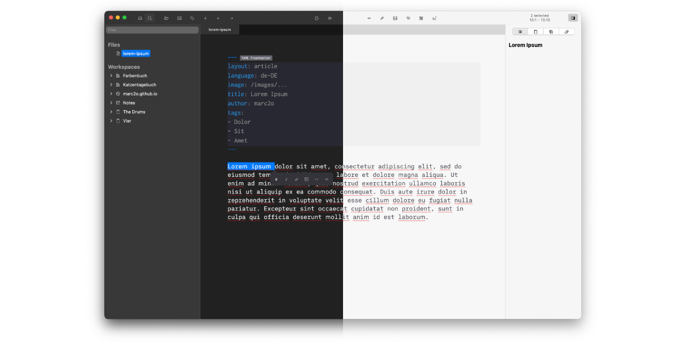

# Zettlr Custom CSS

My personal custom CSS for [Zettlr](https://zettlr.com) to make the text editor look a little bit more like iA Writer. 

However, since the newer Versions of Zettlr really do look so beautiful, I stripped down my custom CSS to just a few basic things:

- Font
- Use macOS accent color instead of theme color
- The same size for text and headings
- Neutral grey background color
- End-of-paragraph marker

Looks best with the _Berlin_ theme, adapts to dark and light mode.

Only tested on macOS, but should work with Windows version, too.

## How to use

1. Open Zettlr (3.2+).
2. Switch to **Berlin** theme
2. Go to **Zettlr > Assets Manager**
3. Switch to **Custom CSS**
4. Paste the CSS source code

## Requirements

- Download and install [**Zettlr**](https://github.com/Zettlr/Zettlr/releases)
- Download and install [**iA Writer Duo**](https://github.com/iaolo/iA-Fonts/tree/master/iA%20Writer%20Duo) (the font used in [iA Writer](https://ia.net/writer))
